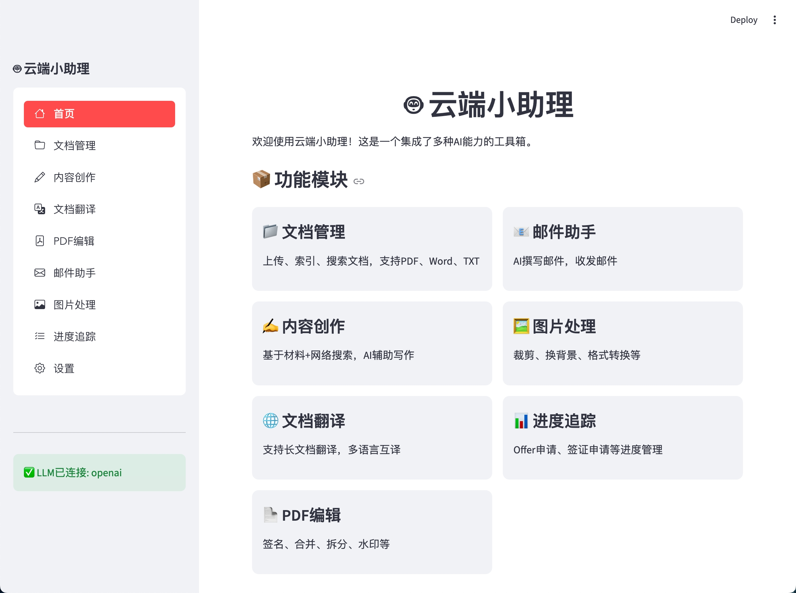
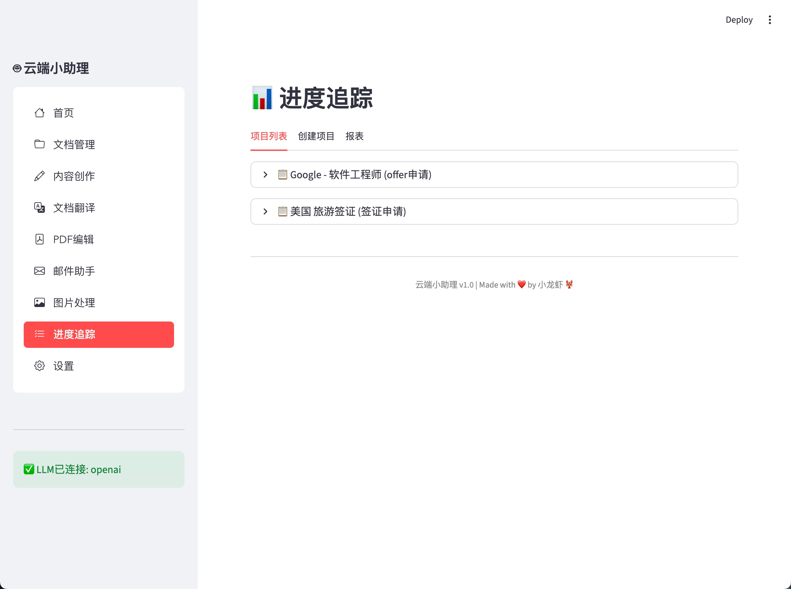

# 云端小助理 🤖

一站式AI办公助手，集成文档管理、内容创作、翻译、PDF编辑、邮件、图片处理、进度追踪等功能。

## 📸 界面预览

### 首页


### 文档管理


### 进度追踪


## ✨ 功能特性

| 功能 | 描述 |
|------|------|
| 📁 文档管理 | 上传、索引、语义搜索文档，快速定位信息（精确到页码） |
| ✍️ 内容创作 | 基于参考材料+网络搜索，AI辅助写作 |
| 🌐 文档翻译 | 支持长文档翻译，多语言互译 |
| 📄 PDF编辑 | 添加签名、合并、拆分、水印等 |
| 📧 邮件助手 | AI撰写邮件，收发邮件 |
| 🖼️ 图片处理 | 去背景、换背景色、裁剪、旋转等 |
| 📊 进度追踪 | Offer申请、签证申请等进度管理与报表导出 |

## 🚀 快速开始

### 1. 安装依赖

```bash
cd cloud-assistant
pip install -r requirements.txt
```

### 2. 配置环境变量

```bash
cp .env.example .env
```

编辑 `.env` 文件，填入你的API Key：

```env
# 选择一个大模型提供商
LLM_PROVIDER=openai

# OpenAI
OPENAI_API_KEY=sk-xxx

# 或者使用国内大模型
# LLM_PROVIDER=zhipu
# ZHIPU_API_KEY=xxx

# LLM_PROVIDER=moonshot
# MOONSHOT_API_KEY=sk-xxx

# LLM_PROVIDER=deepseek
# DEEPSEEK_API_KEY=sk-xxx
```

### 3. 启动应用

```bash
streamlit run app.py
```

浏览器会自动打开 `http://localhost:8501`

## 📖 详细配置

### 大模型配置

支持以下大模型提供商（选一个即可）：

| 提供商 | 环境变量 | 申请地址 | 特点 |
|--------|----------|----------|------|
| OpenAI | `OPENAI_API_KEY` | https://platform.openai.com | GPT-4o, 能力最强 |
| 智谱GLM | `ZHIPU_API_KEY` | https://open.bigmodel.cn | 国产，性价比高 |
| 月之暗面 | `MOONSHOT_API_KEY` | https://platform.moonshot.cn | Kimi，长文本能力强 |
| DeepSeek | `DEEPSEEK_API_KEY` | https://platform.deepseek.com | 价格便宜 |

### 邮件配置（可选）

```env
EMAIL_SMTP_HOST=smtp.gmail.com
EMAIL_SMTP_PORT=587
EMAIL_IMAP_HOST=imap.gmail.com
EMAIL_IMAP_PORT=993
EMAIL_ADDRESS=your-email@gmail.com
EMAIL_PASSWORD=your-app-password
```

**Gmail用户：** 需要在Google账户设置中开启"应用专用密码"

**QQ邮箱：**
```env
EMAIL_SMTP_HOST=smtp.qq.com
EMAIL_IMAP_HOST=imap.qq.com
EMAIL_PASSWORD=授权码（非QQ密码）
```

## 🛠️ 命令行使用（可选）

如果不想用图形界面，也可以直接调用模块：

```python
from modules import get_llm, DocumentIndex, DocumentTranslator

# 使用大模型
llm = get_llm()
response = llm.simple_chat("你好")

# 文档索引与搜索
index = DocumentIndex()
index.add_document("./my_doc.pdf")
results = index.search("关键词")

# 翻译
translator = DocumentTranslator()
translated = translator.translate_text("Hello world", "中文")
```

## 📁 项目结构

```
cloud-assistant/
├── app.py                 # Streamlit主界面
├── demo.py                # 演示版本（无需chromadb）
├── requirements.txt       # 依赖列表
├── .env.example          # 环境变量模板
├── .env                  # 你的配置（需自行创建）
├── modules/              # 功能模块
│   ├── llm_client.py     # 大模型客户端
│   ├── document_processor.py  # 文档处理
│   ├── document_index.py # 文档索引（向量检索）
│   ├── translator.py     # 翻译
│   ├── email_client.py   # 邮件
│   ├── image_processor.py # 图片处理
│   ├── progress_tracker.py # 进度追踪
│   └── web_search.py     # 网络搜索
├── screenshots/          # 界面截图
├── data/                 # 数据存储
│   ├── chroma/          # 向量数据库
│   └── progress.db      # 进度数据库
├── uploads/              # 上传的文件
└── templates/            # 模板文件
```

## ❓ 常见问题

### Q: 文档搜索不准确？
A: 首次使用时，ChromaDB会下载embedding模型（约400MB），请耐心等待。也可以先用 `demo.py` 体验基础功能。

### Q: 图片去背景失败？
A: 需要安装rembg: `pip install rembg`，首次使用会下载模型。

### Q: 翻译速度很慢？
A: 默认使用Google翻译（免费），勾选"使用AI翻译"会调用大模型，更准确但较慢。

### Q: 邮件发送失败？
A: 检查邮箱配置，Gmail需要使用"应用专用密码"而非账户密码。

### Q: chromadb安装失败？
A: 可以先用 `streamlit run demo.py` 运行演示版本，体验除文档索引外的所有功能。

## 📝 更新日志

### v1.0.0
- 初始版本
- 支持7大功能模块
- 支持4种大模型提供商
- 图形化界面（Streamlit）

---

Made with ❤️ by 小龙虾 🦞
